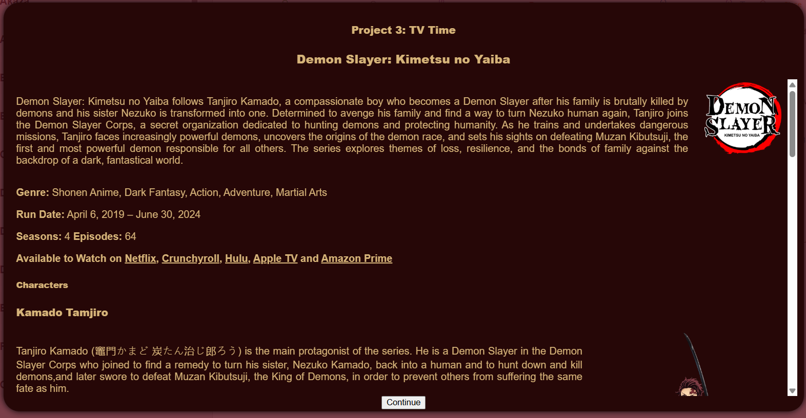

# Tv Time - A Comprehensive Visualization of Kimetsu no Yaiba

## Motivation
Demon Slayer is a widely acclaimed anime series known for its rich characters, emotional depth. Here in this project we are using 61 episodes(total 63)transcripts from 4 seasons to deepen viewer engagement and understanding of the series by transforming the way its story and characters are explored.  Users can interact with the narrative in a more meaningful way, gaining insight into the characters’s next words. The platform allows users to follow the development of individual characters, understand the balance between their inner thoughts and spoken dialogue, and observe how they move through different locations in the story. 
## 
Data

All our transcript data was from the Tumblr user [transcribed anime scripts](https://transcribedanimescripts.tumblr.com/), posted here:  https://transcribedanimescripts.tumblr.com/post/620874161772953600/demon-slayer-kimetsu-no-yaiba-master-list  
They made four transcripts for each episodes, English (sub)  |  English + Romaji  |  English + 日本語  |  日本語. The transcripts themselves are well formatted google docs hosted in their personal google drive. 
Samraysh went through each file and combined them into one [super docment](./data/Demon%20Slayer%20(ENG%20sub).docx). 
 
Jasmine turned this super document into [html](./data/Demon%20Slayer%20(ENG%20sub).html) and made a [python script](./data/generate-csv.py) to parse out the speakers, scenes, actions, and dialouge itself. 
After the data was turned into a .csv, Samraysh went back and made his own [script](./data/map.py). It parses scene information for locations to make a [travel matrix](./data/maptravel.csv) of what characters had moved where for his map visualization. 
For the character selection sidebar, Tulasi parsed the incoming csv data into a weighted character array. This array was used to sort by dialouge count and filter out characters that weren't recurring.

## Visualization Components
When the user loads the application, they are met with an intro pop up which gives a brief overview of Demon Slayer. It provides the viewer with a summary of the plot, streaming services that it is on, characters, number of seasons and episodes,  and running time. It also provides an description and visual of the main characters, including the primary protagonist and antagonist of the show.  
  
When the user clicks continue, they will be taken into the main data view. It is split into two panes with the right pane containing the visualizations that are accessed by clicking the tabs and the left side contains a list of characters. The character list shows images of the characters that have spoken across all episodes. The user can search for a specific character, or order the list alphabetically and by how much the character speaks through out the show. The user can select multiple characters at the same time in order to filter the other visualizations to only include data for the selected characters.  
  
On the right side of the application, the first tab contains the word cloud which displays the most commonly used words based on the size. Hovering over a word will show the number of times it has been said.  
  
Clicking on the word will open a word trie that shows sentences that follow that word in the transcript. It essentially autocompletes the word and hovering over the word will show a pie chart of which characters used that word.  
  
The phrases tab contains a table with the most common phases said during the show.  
  
The map tab displays a fictional map of Japan that is labeled with the main locations in the show. Clicking on a character will trigger an animation that shows the character's movement on the map throughout the show.  
  
The more info tab contains two pie charts that compare the time spent in thought vs spoken out loud and the dialogue spoken by the selected character vs spoken by the other characters. It also displays the stats for the selected characters (seasons appeared, episodes appeared, and total dialogue).  
  
The timeline allows the user to filter the data according to the season and episode number. 
  

## 
Design Sketches and Justifications

### Initial Sketches for the overall layout

by Jasmine 
Shows the character selection on the left, visualization tabs on right, and some mockups of individual visualizations. 
 

 Info button in the bottom left could bring up overlay explaining details about the <em>Demon Slayer</em> series itself.

### Unimplemented "Compare Mode"

by Jasmine 
"Group Mode" (what is implemented) has you look at data from characters in the same scenes while "Compare Mode" would generate two of each visualization to compare and contrast the left-hand side grouping against the left-hand side. This can still be done slighty by opening a word trie, changing your selection to another grouping, and opening a second word trie with the newly filtered data.
the <em>Demon Slayer</em> series itself.

### Extra Widgets and visualizations

by Samraysh 
Initially we wanted to do some analysis on the japanese version of the transcript, but that was found to be out of scope fairly early on. Two of the visualizations in the top right are used in the "More Info" tab in the final visualization.

## Discoveries
- Tanjiro and Nezuko are the only characters who appear in every major location featured throughout the series. Excluding the earliest locations (Mount Kumotori to Asakusa), the closest characters to match their travel footprint are Zenitsu and Inosuke — however, they never visit the Swordsmith Village.
  
- Tanjiro has the most number of lines in the show and his interactions with Inosuke and Zenitsu account for more than a quarter of the dialogue.
  
- Tanjiro is the only character who seems to have had an interaction with almost all other characters
- Zenitsu and Inosuke are rarely shown interacting without Tanjiro present, suggesting that their relationship is mostly mediated through him.
  
- 0.7% of the dialogue (41 lines) is shown to be an outlier in the total data indicating that they are either filtered out characters (characters with less than 20 lines throughout the series)or discrepencies in the dataset
- 17.5% of the lines are in thought form
  
- Kokushibo and Nakime are the only members of the twelve kizuki that have less than 20 lines in the series. (Hanteganu can be considered an exception since his other five forms count since they are technically him)
- Majority of the dialogue seems to occur in the latter half of the series (Post Mugen Train arc [2nd half of 2nd season])
  
## Process
### Development
- Create Miro Cards for each task to fulfill the requirements of the project
- Assign a Miro Card to team member
- Create branch for devlopment
- Work on card to present work at next meeting
- Present work at meeting, if it passes, merge to main
- Repeat process until all Miro cards are complete

### Libraries
- Bootstrap (Bootstrap Icons for UI elements)
- D3 v6 + v7 (automate visualization creation)
- D3.layout.cloud (generating a word cloud)
- Popper.js (Positioning tool for Bootstrap components)
- Custom CSS (popup.css, style.css)

### How to run
Use nginx or a vscode extension like live server to run it locally.   <i>Link to code: https://github.com/DataVis-Spring2025/Project3-TV-Time </i>
You can also access it by visiting the hosted site   <i>Link to site: https://demon-slayer-vis.netlify.app/ </i>

## Demo Video

## Future Improvements
- Have the map show the journey of the selected characters aligned to the same pace throughout the series
- A character tree to illustrate the lineage/relationship between the characters
- Add more information specific to each character (type of attacks and skillsets, sentiment analysis with other characters,...)
- Allow the filtering option to filter characters based on wider variety like demons, slayers, men, women, etc.
- To reduce the discrepancies present in the extracted dataset
- To fix the issue with the word cloud such that it would update whenever a character is selected while being present on another tab

## Team Contributions
### Iswarya Mikkili
- Timeline
- QoL Changes
- Filter
  
### Jasmine Mogadam
- General project management
- [Sketches](#sketches) for some screens
- Some [data](#data) filtering
- Word Cloud
- Word Trie

### Rashi Loni
- amount of time spent in thought vs words spoken out loud
- phrases table
- tabs and panes
- data loading

### Samraysh Pellakur
- Gathered the data
- Pop-Up Window
- Created Map
- Character Stats

### Tulasi Rama Raju Chittiraju
- Character selection
- Group mode (selecting 3 characters max)
